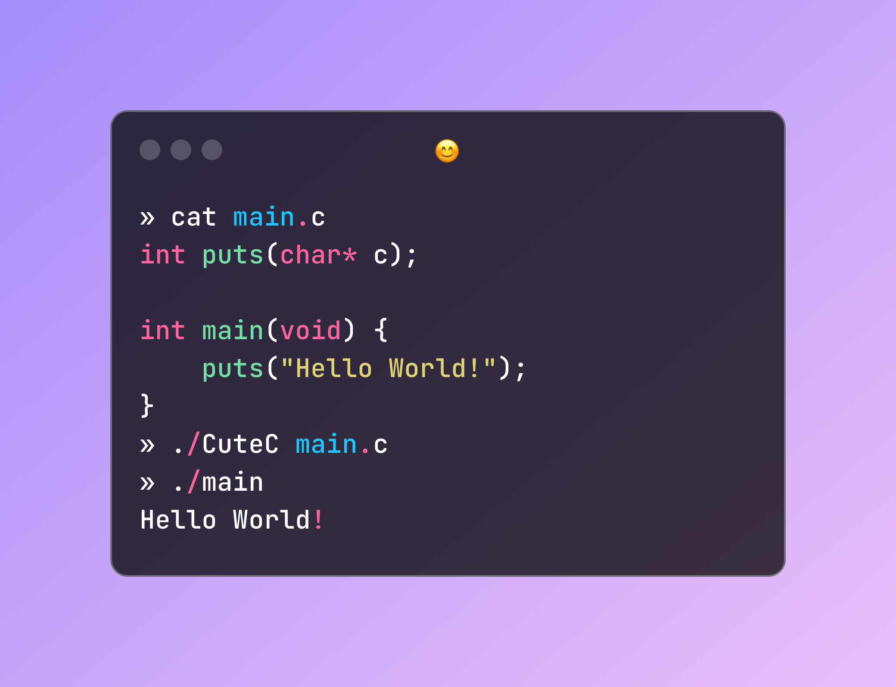

# CuteC - A Toy C Compiler

**CuteC** (pronounced *cutesy* 😊) is a toy C compiler developed as a learning project. The goal is to create a modern **C++23** implementation of an **optimizing C compiler** with support for multiple targets.

<p align="center">
  
</p>

## Features

CuteC currently supports:

- All standard C statements
- An **x86_64** backend
- Most commonly used expressions
- Strict type checking
- Multiple data types (**int, double, char**, etc.)
- String support
- Pointers and memory allocation
- Arrays

## Building the Project

### Requirements

To build CuteC, you need:

- A modern C++ compiler (tested with **G++ 14.2**)
- **CMake >= 3.29**

### Instructions

```sh
git clone https://github.com/upedd/CuteC.git
cd CuteC
cmake -S . -B build  # The CuteC executable will be in the 'build' directory
```

## Usage

To compile a C file using CuteC:

```sh
./cuteC [path_to_input_file]
```

### Important Note

Currently, **CuteC requires GCC** to be installed on your system, as it relies on GCC for **preprocessing, linking, and assembling** the final executable. Future versions will remove this dependency.

## Acknowledgments

Special thanks to **Nora Sandler** and her book [*Writing a C Compiler*](https://nostarch.com/writing-c-compiler) for inspiration.
